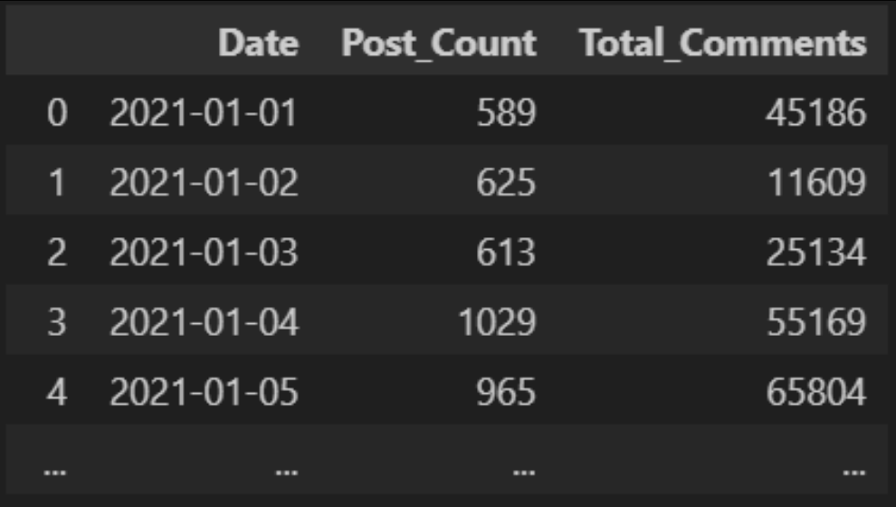

# Data Dabblers: Analysis of GameStop Short Squeeze

## Table of Contents

- [Description](#description)
- [Installation](#installation)
- [Usage](#usage)
- [Credits](#credits)
- [License](#license)

## Description

### Motivation

### Data

#### Data sources:

Alpha Vantage API

CSV file of data scraped from Reddit API - requested from LSE alumni with access to Reddit API.

#### Amount of data collected:

Collected 5484 rows of GME stock price data from the Alpha Vantage API.

Collected over 1.3 million rows of r/wallstreetbets post data from the CSV file.

#### Process of scraping and cleaning Reddit data:

 

#### Process of scraping and cleaning GameStop stock data:

### Exploratory Data Analysis

### Visualisations

## Installation

*What are the steps required to install your project? Provide a step-by-step description of how to get the development environment running.*

## Usage

*Provide instructions and examples for use. Include screenshots as needed.*

## Credits

Adnan Baig (https://github.com/Wickederknave5)

Anna Jin (https://github.com/annajin1)

Hailey Stevens (https://github.com/haileystvns)

Alexander Soldatkin (https://github.com/alex-soldatkin)

*If you used any third-party assets that require attribution, list the creators with links to their primary web presence in this section.*

*If you followed tutorials, include links to those here as well.*

## License

The last section of a high-quality README file is the license. This lets other developers know what they can and cannot do with your project. If you need help choosing a license, refer to [https://choosealicense.com/](https://choosealicense.com/).

## Badges

Badges aren't necessary, per se, but they demonstrate street cred. Badges let other developers know that you know what you're doing. Check out the badges hosted by [shields.io](https://shields.io/). You may not understand what they all represent now, but you will in time.

## Features

If your project has a lot of features, list them here.

## How to Contribute

If you created an application or package and would like other developers to contribute it, you can include guidelines for how to do so. The [Contributor Covenant](https://www.contributor-covenant.org/) is an industry standard, but you can always write your own if you'd prefer.

## Tests

Go the extra mile and write tests for your application. Then provide examples on how to run them here.
