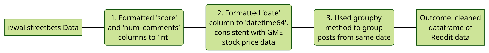

Project description:

What your application does?

What made you curious about this kind of data in the first place?

How did you gather the data?  Why you used the technologies you used?

What is in the data?  What does it look like in general?

What did you find out about the data?  (Exploratory Data Analysis)

Some of the challenges you faced and features you hope to implement in the future.

# Analysis of the 2020-2021 GameStop Short Squeeze

## *Table of Contents*

1. [Description](#description)
2. [Installation](#installation)
3. [Usage](#usage)
4. [Data](#data)
5. [Visualisations](#visualisations)
6. [Credits](#credits)
7. [License](#license)
8. [Tests](#tests)

## PROJECT OVERVIEW

Welcome to Project Data Dabblers, which delves into the GameStop (GME) short squeeze phenomenon. Our primary objective is to shed light on the causation and degree of influence the Reddit community, r/wallstreetbets, had on the stock price of GameStop. We conducted an analysis of GME stock data in relation to r/wallstreetbets posts, over the period December 2020 to March 2021. 

### *Motivation*

Our project stems from a fascination with this event and its disruption to traditional financial norms, its empowerment of online communities, and its ensuing impact on regulation. Through our analysis, we aim to reveal the role of online communities on stock market behaviour.

### *Context*

The GameStop short squeeze in early 2021 saw a remarkable surge in the stock price of GameStop (GME). This surge was orchestrated by retail investors, particularly through the Reddit community r/wallstreetbets. As these investors bought GME shares en masse, it forced hedge funds and institutional investors, who had bet against the stock, to cover their positions, causing GME's price to skyrocket.

## INSTALLATION

### *Installation for MacOS*

Run code in the command line:

pip install -r requirements.txt

### *Installation for Windows*

## USAGE

*Provide instructions and examples for use. Include screenshots as needed.*

## DATA

### *Data Sources*

1. Alpha Vantage API
2. CSV file of Reddit API data - sourced from LSE alumni

### *Collection and Cleaning of Reddit Data*
#### Relevant folder: [Reddit CSV Files](data/reddit_data)

Collection Process:

Cleaning Process:

Comparision of original data frame to cleaned data frame:

Header of cleaned Reddit data frame:

### *Collection and Cleaning of GameStock Stock Data*
#### Relevant folder: [GME JSON Files](data/gme_data)

Collection Process:

Cleaning Process:

Header of cleaned and merged GME data frame:

### *Exploratory Data Analysis*
Collected 5484 rows of GME stock price data from the Alpha Vantage API.
Collected over 1.3 million rows of r/wallstreetbets post data from the CSV file.

## VISUALISATIONS

## CREDITS

Adnan Baig (https://github.com/Wickederknave5)

Anna Jin (https://github.com/annajin1)

Hailey Stevens (https://github.com/haileystvns)

Alexander Soldatkin (https://github.com/alex-soldatkin)

### Work Contribution

|Contributors (%)|Data Collections (%)|Data Cleaning (%)|Visualisations (%)|Repository Organisation (%)|Documentation (%)|
|-----------|-----------|-----------|-----------|-----------|-----------|
|Adnan Baig|-----------|-----------|-----------|-----------|-----------|
|Anna Jin|-----------|-----------|-----------|-----------|-----------|
|Hailey Stevens|N/A|N/A|N/A|-------|80|

*If you used any third-party assets that require attribution, list the creators with links to their primary web presence in this section.*

*If you followed tutorials, include links to those here as well.*

## LICENSE

MIT License, see [LICENSE](LICENSE) for further information.

## TESTS

Go the extra mile and write tests for your application. Then provide examples on how to run them here.
