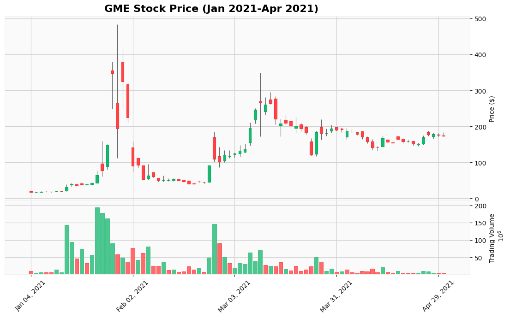
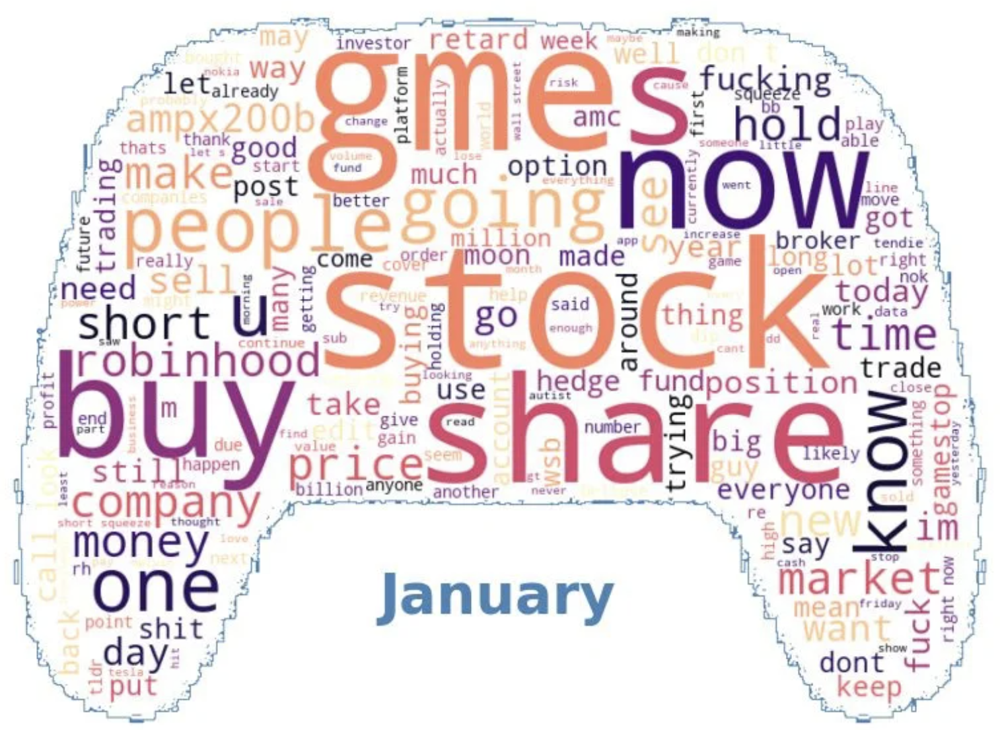
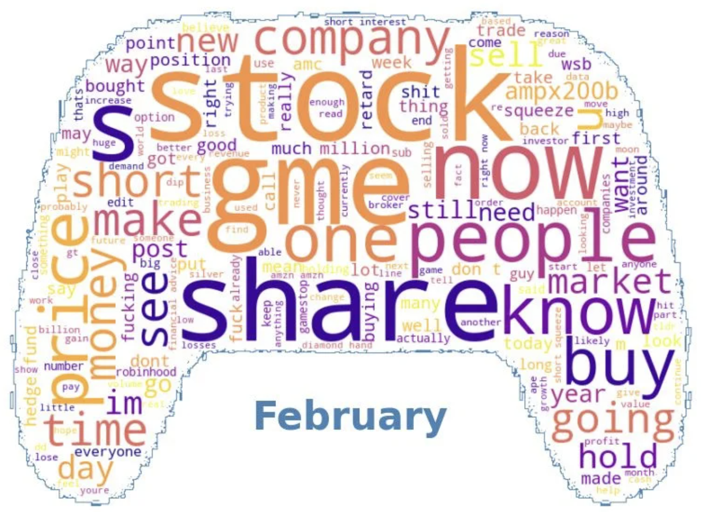
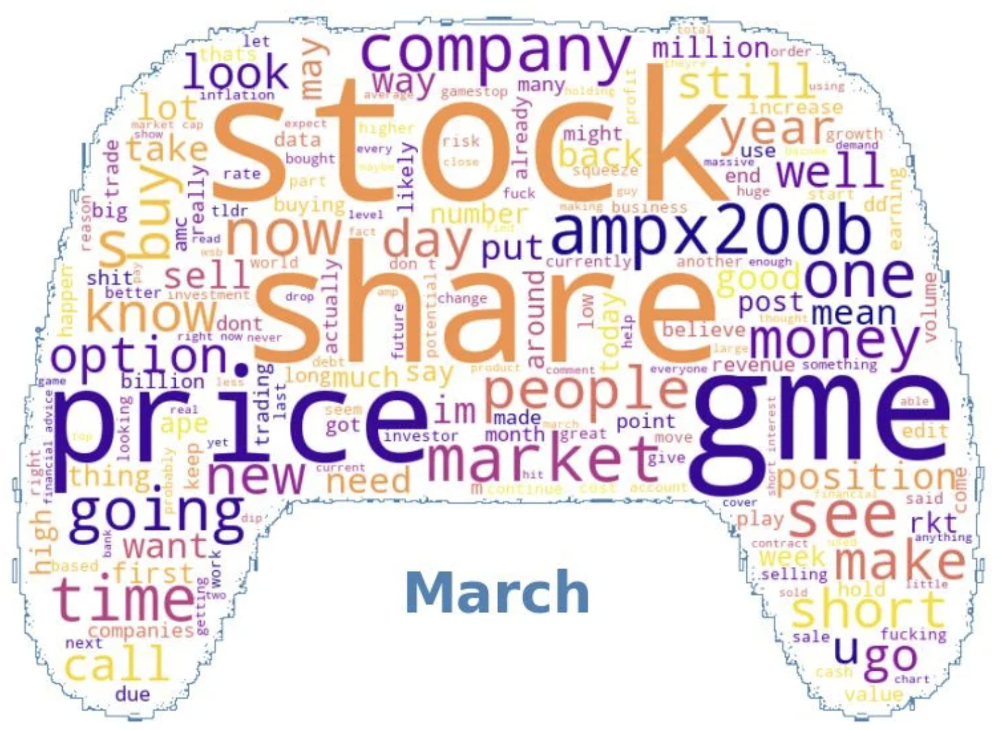
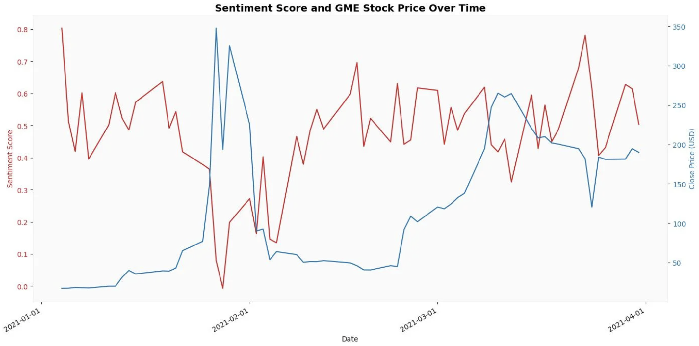

# Analysis of the 2020-2021 GameStop Short Squeeze

## *Table of Contents*

1. [Project Overview](#project-overview)
2. [Installation](#installation)
3. [Usage](#usage)
4. [Data](#data)
5. [Visualisations](#visualisations)
6. [Credits](#credits)
7. [License](#license)

 

## PROJECT OVERVIEW

Welcome to Project Data Dabblers, which delves into the GameStop (GME) short squeeze phenomenon. Our primary objective is to shed light on the causation and degree of influence the Reddit community, r/wallstreetbets, had on the stock price of GameStop. We conducted an analysis of GME stock data in relation to r/wallstreetbets posts, over the period December 2020 to March 2021. 

### *Motivation*

Our project stems from a fascination with this event and its disruption to traditional financial norms, its empowerment of online communities, and its ensuing impact on regulation. Through our analysis, we aim to reveal the role of online communities on stock market behaviour.

### *Context*

The GameStop short squeeze in early 2021 saw a remarkable surge in the stock price of GameStop (GME). This surge was orchestrated by retail investors, particularly through the Reddit community r/wallstreetbets. As these investors bought GME shares en masse, it forced hedge funds and institutional investors, who had bet against the stock, to cover their positions, causing GME's price to skyrocket.

### *Interactive Timeline* 

[Click here for notebook](https://github.com/lse-ds105/ds105a-project-data-dabblers/blob/main/visualisations/timeline.ipynb)

See website for full timeline.

 

## INSTALLATION

Run in the command line:

    pip install -r requirements.txt

 

## USAGE

To reproduce the code and visualisations in the website run:
1. 'stock_price_scraping.ipynb' in the scraping folder
2. 'timeline.ipynb' in the visualisations folder
3. 'interactive_plot.ipynb' in the visualisations folder
4. 'lda_visualisation.ipynb' in the visualisations folder
5. 'wordcloud_visualisation.ipynb' in the visualisations folder

 

## DATA

### *Data Sources*

1. Alpha Vantage API
2. CSV file of Reddit API data - sourced from LSE alumni

 

### *Collection and Cleaning of Reddit Data*

Relevant folder: [Reddit CSV Files](https://github.com/lse-ds105/ds105a-project-data-dabblers/tree/main/data/reddit_data)

#### Collection process:

#### Cleaning process:

#### Comparision of original data frame to cleaned data frame:

    
    

#### Header of cleaned Reddit data frame:

 

### *Collection and Cleaning of GameStock Stock Data*

Relevant file: [GME JSON File](https://github.com/lse-ds105/ds105a-project-data-dabblers/blob/main/data/gme_data/gme_daily_data.json)

#### Collection process:

#### Cleaning process:

#### Header of cleaned and merged GME data frame:

 

### *Data Analysis*

#### Candlestick chart:

#### Interactive plot: [click here for notebook](https://github.com/lse-ds105/ds105a-project-data-dabblers/blob/main/visualisations/interactive_plot.ipynb)

See website for full plot.

 

## VISUALISATIONS

#### Word cloud analysis:

    
    
    

#### LDA analysis: [click here for notebook](https://github.com/lse-ds105/ds105a-project-data-dabblers/blob/main/visualisations/LDA_visualisation.ipynb)

See website for full visualisation.

#### Sentiment analysis:

 

## CREDITS

Adnan Baig (https://github.com/Wickederknave5)

Anna Jin (https://github.com/annajin1)

Hailey Stevens (https://github.com/haileystvns)

Alexander Soldatkin (https://github.com/alex-soldatkin)

### Work Contribution

|Contributors (%)|Data Collections (%)|Data Cleaning (%)|Visualisations (%)|Repository Organisation (%)|Documentation (%)|
|-----------|-----------|-----------|-----------|-----------|-----------|
|Adnan Baig|50|50|50|35|10|
|Anna Jin|50|50|50|35|10|
|Hailey Stevens|N/A|N/A|N/A|30|80|

 

## LICENSE

MIT License, see [LICENSE](LICENSE) for further information.